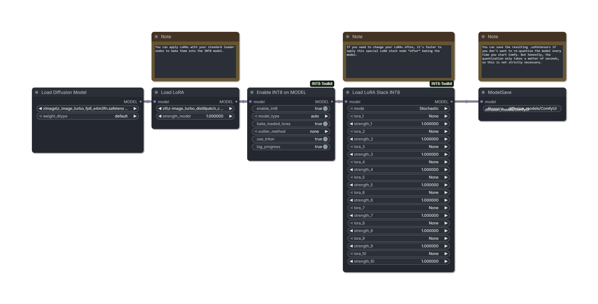

# ComfyUI-INT8-Toolkit

INT8 quantization stores model weights in 8-bit integers instead of higher-precision formats, which can reduce VRAM use and speed up matrix-heavy inference on GPUs with strong INT8 throughput. This is particularly helpful with 30-series Nvidia cards. The tradeoff is that quantization changes the numerical representation of the model, so quality, compatibility, and patching behavior need to be handled deliberately.

This project began as a fork of [ComfyUI-INT8-Fast](https://github.com/BobJohnson24/ComfyUI-INT8-Fast), but it is now maintained as its own INT8 solution for ComfyUI rather than a mere compatibility branch.



This codebase has its own workflow model, node surface, adapter behavior, and performance tuning path, while continuing to selectively incorporate useful upstream fixes.

The main differentiator is `Enable INT8 on MODEL`: a `MODEL -> MODEL` node that can convert a model loaded by ComfyUI's stock diffusion loader into this extension's INT8 runtime. That lets standard diffusion loaders and stock LoRA loaders remain part of the workflow, then INT8 can be enabled after those patches are in place.

Other notable differences from upstream include unified INT8 LoRA nodes with selectable standard, stochastic, or dynamic behavior, safer adapter fallback handling, runtime kernel tuning controls, and additional stock-loader compatibility work.

Tested primarily with FLUX.2 Klein and Z-Image style models. Other architectures may need different exclusion presets or quality checks.

## Recommended Workflows

### Pre-Quantized Or OTF INT8 Loader

Use this when you are already loading an INT8 checkpoint, or when you want the extension to quantize eligible layers during model load.

```text
Load Diffusion Model INT8 (W8A8)
-> optional Load LoRA INT8
-> sampler
```

`Load Diffusion Model INT8 (W8A8)` supports pre-quantized INT8 checkpoints and optional on-the-fly quantization for float or FP8 source weights.

### Stock Loader Compatibility

Use this when your graph is built around ComfyUI's stock loaders.

```text
Load Diffusion Model
-> optional stock Load LoRA nodes
-> Enable INT8 on MODEL
-> sampler
```

With `bake_loaded_loras` enabled, `Enable INT8 on MODEL` applies stock LoRA weight patches in float space, quantizes the resulting layer weights, and removes consumed weight patches so they are not applied twice. Bias patches and excluded-layer patches are left for ComfyUI to handle normally.

### Add Or Swap LoRAs After INT8

Use this when the model is already INT8 and you want to add or change LoRAs without re-running the stock-loader bake step.

```text
INT8 model
-> Load LoRA INT8
-> sampler
```

`Load LoRA INT8` has a `mode` selector:

- `Stochastic`: applies the LoRA delta into INT8 weights with stochastic rounding.
- `Dynamic`: keeps compatible plain LoRAs as runtime additions instead of modifying INT8 weights.
- `Standard`: applies the LoRA through ComfyUI's regular MODEL patch path without INT8-specific handling. This is useful for pre-INT8 A/B testing against `Stochastic`.

## LoRA Order And VRAM Behavior

Some LoRA orders can temporarily materialize large float tensors. On lower-VRAM cards this can look like a sudden spike and may OOM even if normal sampling would fit.

| LoRA method | Before `Enable INT8 on MODEL` | After `Enable INT8 on MODEL` | Notes |
| --- | --- | --- | --- |
| Stock `Load LoRA` | Best stock-loader path. The LoRA is baked by `Enable INT8 on MODEL` when `bake_loaded_loras` is enabled. | Avoid for INT8 layers unless testing. ComfyUI's generic patch path may dequantize or build large temporary tensors. | Easiest compatibility path before INT8. Riskier after INT8 because it is not INT8-aware. |
| `Load LoRA INT8` with `Standard` | Equivalent to a stock-style MODEL-only LoRA patch. Useful when you want the same node surface before INT8 and plan to bake later with `Enable INT8 on MODEL`. | Mainly for testing. It intentionally skips INT8-specific handling, so post-INT8 behavior follows ComfyUI's generic patch path. | Best fit for fast A/B comparisons against `Stochastic` on an existing pre-INT8 LoRA stack. |
| `Load LoRA INT8` with `Stochastic` | Carries deferred INT8-aware patches so `Enable INT8 on MODEL` can quantize the base layer first, then apply the LoRA with stochastic INT8 rounding. | Preferred for adding LoRAs after INT8. Plain LoRA adapters use INT8-aware stochastic patching. | This is the mode to compare against `Standard` when you want pre-INT8 A/B testing with the same node surface. |
| `Load LoRA INT8` with `Dynamic` | Not the preferred order. Dynamic LoRA state is intended for an INT8 runtime path, and baking behavior is less direct than stock LoRA patches. | Preferred when the LoRA is compatible and you can accept slower runtime. Compatible plain LoRAs are applied during forward passes. | Avoids permanently changing INT8 weights, but adds runtime matmuls. Unsupported formats fall back to static-safe patching and can spike like stochastic mode. |

Practical guidance:

- For stock workflows, put stock `Load LoRA` before `Enable INT8 on MODEL`.
- If you want to A/B the same `Load LoRA INT8` or `Load LoRA Stack INT8` graph before INT8 conversion, switch `mode` between `Standard` and `Stochastic`.
- For already-INT8 workflows, use `Load LoRA INT8` after INT8 is enabled.
- If a graph OOMs during LoRA application but not during sampling, try the other INT8 LoRA mode, reduce the LoRA stack, or bake the LoRA before INT8 conversion.
- Leave `bake_loaded_loras` enabled unless you intentionally want patched layers skipped by the adapter.

## Node Summary

### Load Diffusion Model INT8 (W8A8)

Loads INT8 diffusion models using `Int8TensorwiseOps` and architecture-specific exclusion presets.

When `on_the_fly_quantization` is enabled, eligible float or FP8 weights are quantized to INT8 with per-row weight scales. `outlier_method` controls whether compatible OTF layers use an outlier-mitigation transform before quantization.

Supported `model_type` presets:

- `flux2`
- `z-image`
- `chroma`
- `wan`
- `ltx2`
- `qwen`
- `ernie`
- `anima`
- `sdxl`

> [!NOTE]
> SDXL can be slower with INT8 enabled because we only quantize linear layers while SDXL still spends substantial time in convolutional UNet blocks, attention kernels, and other non-INT8 work. Larger transformer-heavy architectures are more likely to see a speedup.

### Enable INT8 on MODEL

Converts an already-loaded diffusion `MODEL` to INT8 by object-patching eligible linear layers.

Settings:

- `model_type`: defaults to `auto`, which inspects the loaded `MODEL` and selects a known exclusion preset when possible. Use a specific preset to override detection. Use `none` only for experiments because it disables preset exclusions.
- `bake_loaded_loras`: applies current stock LoRA weight patches before quantization and removes consumed patches.
- `outlier_method`: choose `none`, `quarot`, or `hadanorm`. `quarot` applies the Hadamard rotation path for compatible layers. `hadanorm` adds static per-channel scaling, Hadamard mixing, dynamic centering, and a runtime correction term on compatible layers.
- `use_triton`: toggles this extension's Triton INT8 matmul path.
- `log_progress`: prints quantization progress and layer counts.

Outlier method guidance:

| Method | Behavior | Speed expectation |
| --- | --- | --- |
| `none` | Quantizes eligible layers directly with per-row weight scales and dynamic activation quantization. | Fastest path and the default. |
| `quarot` | Applies Hadamard rotation to compatible layers before quantization and rotates activations at runtime. | Usually between `none` and `hadanorm`. |
| `hadanorm` | Applies static per-channel scaling, Hadamard mixing, dynamic centering, and a correction term. Post-INT8 LoRA patching uses the same transformed space. | Slowest of the three because it adds extra runtime math. |

`hadanorm` is experimental in this project. It uses a static sigma heuristic derived from weight-channel magnitudes rather than a separate calibration pass, so treat it as a quality/speed comparison mode rather than a settled default. It is compatible with `TorchCompileModelAdvanced`, but compiled speed is still expected to lag behind `none` because the transform and correction work are fairly heavy operations.

If `auto` cannot identify the architecture, the adapter uses a conservative union of known exclusion patterns and logs a warning. Manual `model_type` selection is faster when you know the architecture.

### Load LoRA INT8

Loads one LoRA with selectable `Stochastic`, `Dynamic`, or `Standard` mode.

`Stochastic` mode is the speed-oriented INT8 path and can now be queued before `Enable INT8 on MODEL` without collapsing into the same bake behavior as `Standard`. `Dynamic` mode can preserve more of the original LoRA math for compatible plain LoRAs, but it is slower because extra LoRA matmuls run during inference. `Standard` mode uses ComfyUI's regular MODEL LoRA patching without INT8-specific wrapping.

### Load LoRA Stack INT8

Loads up to 10 LoRAs with the same mode behavior as `Load LoRA INT8`.

In `Stochastic` mode, compatible LoRAs are combined before one stochastic rounding step. This is usually better than repeatedly rounding each LoRA one by one. In `Standard` mode, the stack behaves like chaining stock MODEL-only LoRA patches.

### INT8 Kernel Config

Applies fixed Triton kernel settings at runtime. Optional microbench mode tests candidate configs and prints environment variable values that can be reused later.

Environment variables:

- `INT8_TRITON_AUTOTUNE`
- `INT8_TRITON_BLOCK_M`
- `INT8_TRITON_BLOCK_N`
- `INT8_TRITON_BLOCK_K`
- `INT8_TRITON_GROUP_SIZE_M`
- `INT8_TRITON_NUM_WARPS`
- `INT8_TRITON_NUM_STAGES`
- `INT8_SMALL_BATCH_FALLBACK_MAX_ROWS`
- `INT8_SMALL_BATCH_FALLBACK_MIN_ROWS`
- `INT8_SMALL_BATCH_FALLBACK_ADAPTIVE`
- `INT8_DYNAMIC_LORA_DEBUG`
- `INT8_DYNAMIC_LORA_BATCH`
- `INT8_DYNAMIC_LORA_BATCH_MAX_RANK`
- `INT8_FORCE_DISABLE_TORCH_COMPILE`

## ModelSave Round Trip

If you quantize with `on_the_fly_quantization` and save with ComfyUI `ModelSave`, the saved checkpoint can be loaded back with `Load Diffusion Model INT8 (W8A8)` without re-quantizing as long as the checkpoint includes INT8 `weight` tensors and matching `weight_scale` tensors.

## Checkpoint Notes

Pre-quantized checkpoints are still useful when available. On-the-fly quantization is more flexible, but it requires loading source weights and quantizing them locally. On a Geforce 3090, this process should only take 5-10 seconds.

Vistralis checkpoints:

| Model | Link |
| --- | --- |
| FLUX.2-klein-base-9b | [Download](https://huggingface.co/vistralis/FLUX.2-klein-base-9b-INT8-transformer) |
| FLUX.2-klein-base-4b | [Download](https://huggingface.co/vistralis/FLUX.2-klein-base-4b-INT8-transformer) |
| FLUX.2-klein-9b | [Download](https://huggingface.co/vistralis/FLUX.2-klein-9b-INT8-transformer) |
| FLUX.2-klein-4b | [Download](https://huggingface.co/vistralis/FLUX.2-klein-4b-INT8-transformer) |

Additional checkpoints:

| Model | Link |
| --- | --- |
| Chroma1-HD | [Download](https://huggingface.co/bertbobson/Chroma1-HD-INT8Tensorwise) |
| Z-Image-Turbo | [Download](https://huggingface.co/bertbobson/Z-Image-Turbo-INT8-Tensorwise) |
| Anima | [Download](https://huggingface.co/bertbobson/Anima-INT8-QUIP) |

## Requirements

- Recent ComfyUI
- NVIDIA GPU with useful INT8 throughput
- PyTorch build compatible with your ComfyUI install
- Triton for the fused kernel path

Windows works fine with a compatible Triton build.

## Performance Notes

Upstream reported roughly 1.5x to 2x faster inference on an RTX 3090 depending on model, settings, and whether Torch compile is effective. INT8 is most useful on GPUs with strong INT8 throughput. It is not guaranteed to beat native FP8 paths on newer cards.

Architecture matters: compact or convolution-heavy models such as SDXL may run slower after W8A8 conversion because dynamic activation quantization and dequantization overhead can outweigh the saved linear matmul time.

## Credits

- dxqb / OneTrainer INT8 work: https://github.com/Nerogar/OneTrainer/pull/1034
- silveroxides / convert_to_quant: https://github.com/silveroxides/convert_to_quant
- silveroxides / ComfyUI-QuantOps: https://github.com/silveroxides/ComfyUI-QuantOps
- newgrit1004 / QuaRot reference code: https://github.com/newgrit1004/ComfyUI-ZImage-Triton
